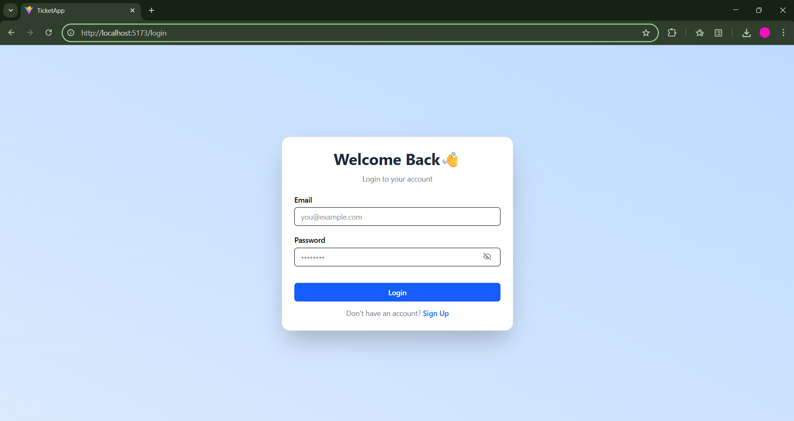
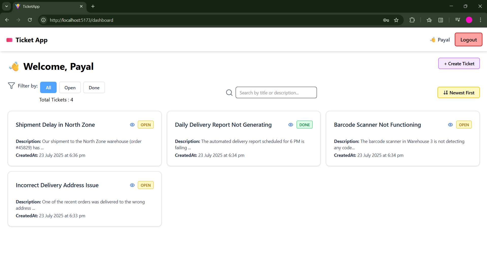
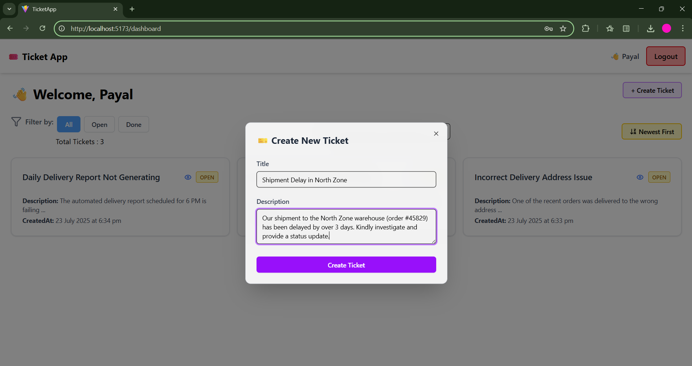
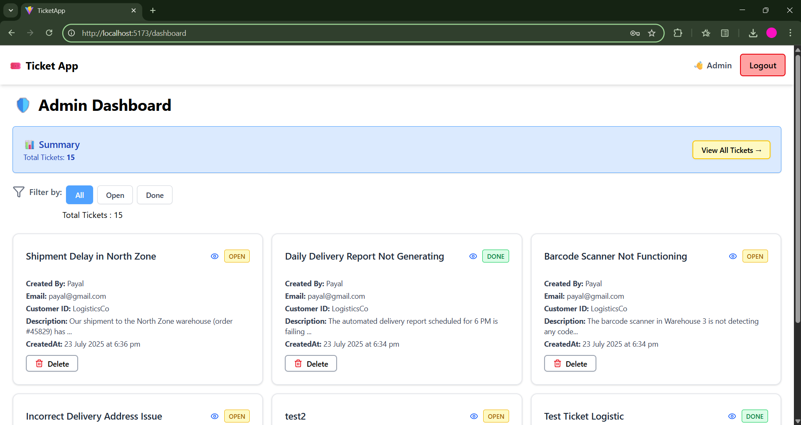
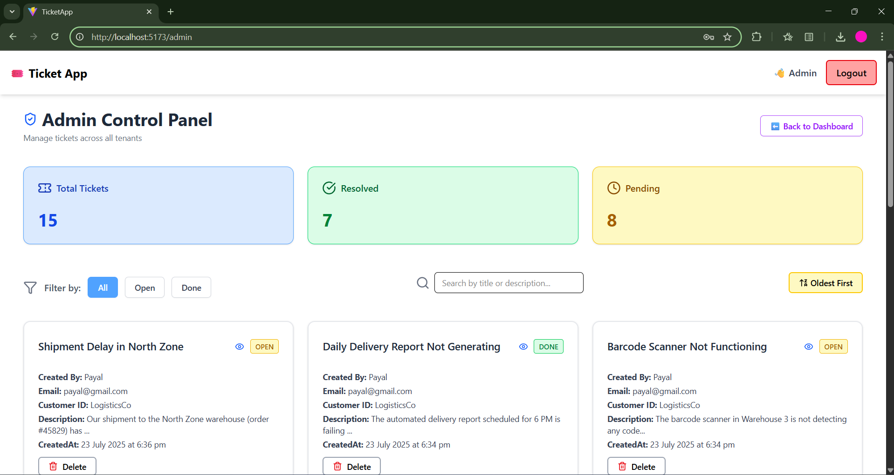
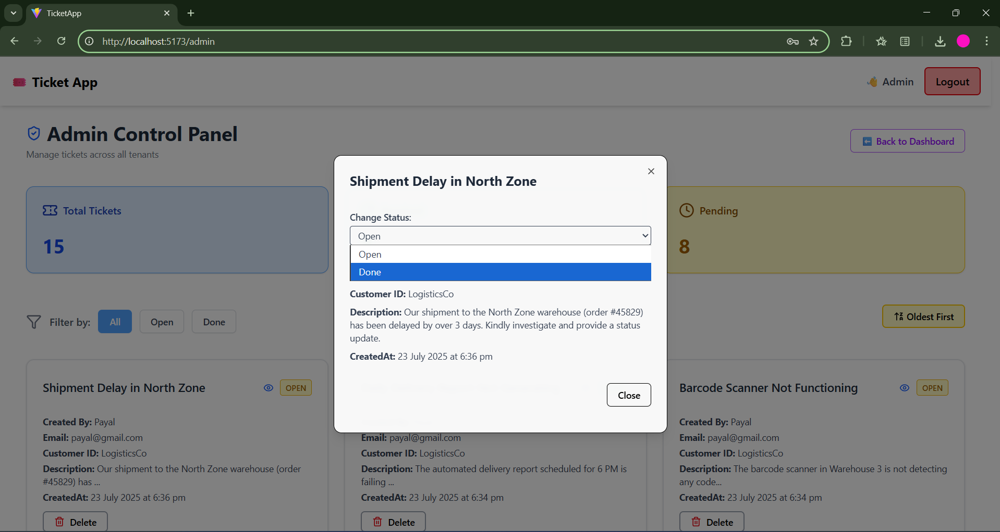
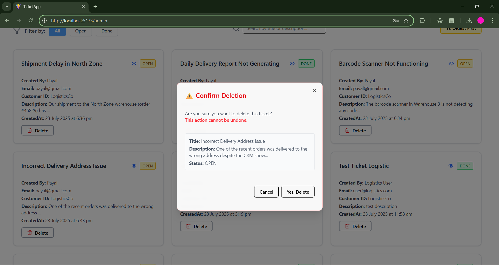

# 🧾 TicketApp – Multi-Tenant Support with Email and Real-time Updates

This is a **Full Stack Ticket Management System** built for the Flowbit Internship Challenge. It supports **multi-tenant architecture**, **JWT authentication**, **real-time ticket updates**, **manual status changes by Admin**, and **email notifications via n8n**.

---

## 🚀 Tech Stack

**Frontend:**
- React + Vite
- Redux Toolkit
- TailwindCSS
- Axios

**Backend:**
- Node.js + Express
- MongoDB (Dockerized)
- Socket.IO (Real-time)
- JWT Authentication

**DevOps / Integration:**
- Docker Compose (backend, MongoDB, n8n)
- n8n (for email automation)
- .env for secret config
 ---
 ## 🎥 Demo Video

📽️ **[Click here to watch the demo video](assets/demo.mp4)**

 ## Screenshots 
 
 #### Login Page


 #### User Dashboard 


#### Create Ticket 


#### Admin Dashboard 


#### Admin Control Panel  


#### Change Status Of Ticket 


#### Delete Ticket 


 ---
  ## 🚀 Quick Start Instructions

## 1. **Clone the Repo**
- git clone https://github.com/your-username/multi-tenant-ticketing-app.git
- cd TicketApp

## 2. **Start Docker containers (MongoDB, Backend, n8n)**
- docker-compose up --build -d

## 3. **Run seed script (only once)**
- node seed.js

## 4. **Start frontend**
- cd frontend
- npm install
- npm run dev


### 🧪 Sample Credentials

#### LogisticsCo
- **User:** user@logistics.com / `password123`

#### RetailGmbH
- **User:** user@retail.com / `password123`

#### Admin
- **Admin:** admin@logistics.com / `password123`

## 🔁 Application Flow

- Users can register by selecting a tenant.
- After login, users can:
  - Create new tickets.
  - View only their own tickets.
- Admins can:
  - View all tickets across tenants.
  - Update ticket status to "Done".
  - Delete any ticket.
- When a new ticket is created:
  - n8n sends a confirmation email via webhook.
- All updates reflect in real-time (Socket.IO).

## 📦 Seed Script Purpose

### 📦 Seed Script

The `seed.js` script inserts:
- Two tenants: LogisticsCo and RetailGmbH
- One Admin user

```md
To run:

```bash
node seed.js
```

## 🔧 .env Configuration (Used in Docker)
### Backend:

- PORT=8000

- MONGO_URI=mongodb://mongo:27017/ticketdb

- JWT_SECRET=your-secret-key

- WEBHOOK_SECRET=your-webhook-key

- N8N_WEBHOOK_URL=http://n8n:5678/webhook/ticket-created

### n8n:

- N8N_BASIC_AUTH_USER=admin

- N8N_BASIC_AUTH_PASSWORD=admin123


